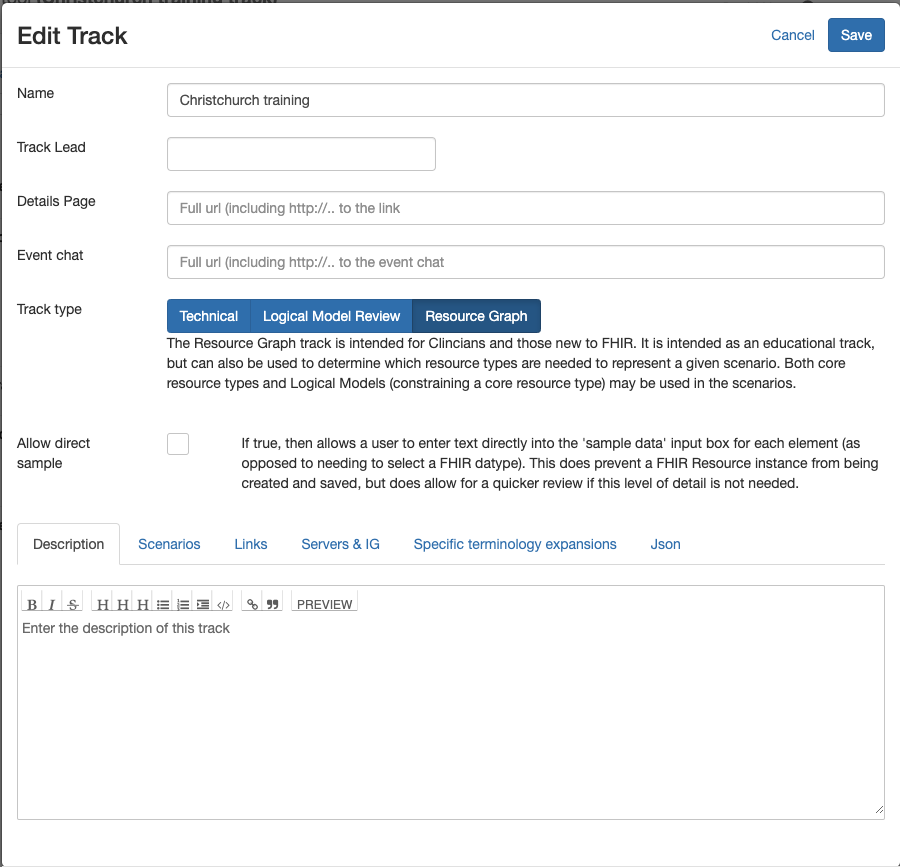

##Creating a track

Any user can create a track. This is done by clicking the 'Add a new track' link below the list of tracks. The following options are available.

* **Name**: The name of the track which will appear in the track list. Keep it short.
* **Track Lead**: The person managing the track. If entered (it's optional) then only this person can make changes to the track 0 including changing the track lead.
* **Details Page**: A link to a page that has more details on the track. A link to the page is displayed when the track is selected.
* **Event Chat**: The [Zulip chat stream]() used for supporing track participants
* **Track Type**: The type of track. There are 3 types:
    * **Technical** tracks contain functionity to record clients and servers participating in the track, and to record the outcome of testing
    * **Logical Model Review** are for creating 'instances' of ligical models. Less commonly used
    * **Resource Graph** tracks support the graph builder.
* **Allow direct sample** is shown when the track type is Logical model or Resoruce graph and allows a user to enter element values direclty into the model as text. This is convenient, but does prevent data being saved on the server as the data is not consistent with FHIR datatypes.
* **Allow Graphs** is shown when the track type is technical, and will show the Graph  Builder (which is generally hidden for this track type.

At the bottom of the dialog is a tabset with the following options.

* **Description** a more complete description of the track. This will be displayed when the track is selected.
* **Scenarios** displays the scenarios that have been created for the track and allows them to be re-ordered.
* **Links** are any extra links of interest to track participants. They will appear as links when the track is selected. Add the link by clicking the + button to the right
* **Servers & IG** is displayed for a track type of Logical Model and Resource Graph and is where the servers for the track are selected. There are 3 servers that should be configured either by selecting them from the list or entering the url to the FHIR root into the text boxes
    * The **Terminology** server has the terminology resources required (ValueSets, CodeSystems etc) and must support the $expand operation
    * The **Conformance** server has the conformance resources - eg StructureDefinition
    * The **Data** server is where resource instances will be saved / loaded - see [Server Interaction](graphServer.md) for details
    * The **Implementation Guide** is not currently used.

    The other tabs can be ignored.

