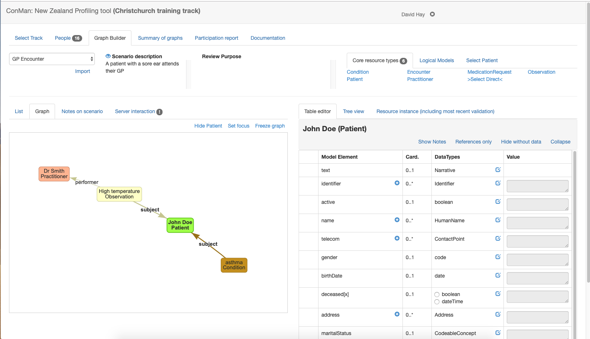

## Select a graph
To create (or edit) a graph, select the 'Graph Builder' tab that is shown when an appropriate track is selected. 

### Top pane
The tab has the following panes.

The **top pane** has a number of sections from left to right.

* All the scenarios are displayed in a drop down to the upper left. Selecting a scenario will display the graph that has been created by the user for that scenario - or an empty space where the graph can be created.
* Immediately below the drop down is an 'import' link. Clicking this link displays a dialog containing any graphs that have been created by any user for scenarios in this track. Selecting a graph will create a copy in the current users space where they can edit it (the original is uneffected). Note that any existing  graph will be replaced).
* Next is a description of the scenario. Only a few lines are displayed - clicking the 'eye' icon will display the full details of the scenario.
* Then, the review purpose (if entered) is displayed.
* Finally the palette of resource types is displayed. The palette has 3 sub tabs:
    * **Core resource types** - or the resource types defined in the specification. A subset will be displayed for immediate selection (defined in the scenario), or any type can be selected using the 'Select Direct' link.
    * **Logical models** are created by the clinFHIR logical modeller. They act the same way as core resource types, but the instances cannot be saved on the server
    * **Select patient** allows an existing patient from the server 

Graphs are created by selecting a resource type from the pallette to the upper right and giving it a short name (which is only used as a label on the graph). This will result in a resource of that type being added to the graph.

When the scenario is created by the designer, the resource types that are most likely to be needed for that scenario are added to the scenario and will be displayed in the palette 

Below the top pane, the screen is divided into a left and right pane.

### Bottom left pane (display)

The left pane has a number of sub tabs

* the **List** tab displays the resource instances in the graph in the form of a table showing each resource instance, with a number of properties of the resource.
    * The resource **Type**. Clicking on the type will select it, showing the editor pane to the right. The question mark icon will open the page in the spec that describes that type.    
    * The **Category** of the resource (core or logical). Only core instances can be saved in the data server.
    * The **Title** of the resource that was entered when the instance was created. It can be changed by clicking on it. The title is saved with the graph, but is not part of the resource itself (ie if the resource is saved to the server, then the title is not part of it). It's purpose is to identify the resource instance in the graph
    * The **References** tab lists the references from that resource to another. Clicking on the *x* icon will remove that reference.
    * Finally, the column to the right also has an *x* icon that will remove the resource instance when clicked.
* The **Graph** tab displays the resource instances with lines connecting them. Each line is a reference from one resource to another. Clicking on a resource selects and shows the details in the editor pane to the right. Resources can be dragged around in the graph. Resources that are not connected to any other 'float' in the graph. It pays to connect them as soon as possible. There are a number of links to the upper right of the graph that effect the graph display:
    * **Hide Patient** suppresses the display of a Patient resource, including any references to it.
    * **Set focus** hides all resources (and references) other than those that have a direct reference to or from the currently selected resource. When a resource has a focus in this way, the link name changes to **Show all**
    * **Freeze graph** stops the dynamic re-arrangement of the graph when a resource is dragged. Useful when creating an image of the graph, which can be done by right clicking on the graph.
* **Notes on scenario** allow any note to be attached to the scenario graph. Useful when reviewing a graph, but not often used.
* **Server interaction** allows the resources in the graph to be saved on the data server. This is further described [here](graphServer.md)

###Bottom right tab
This tab is where the contents of the currently selected resource 
    