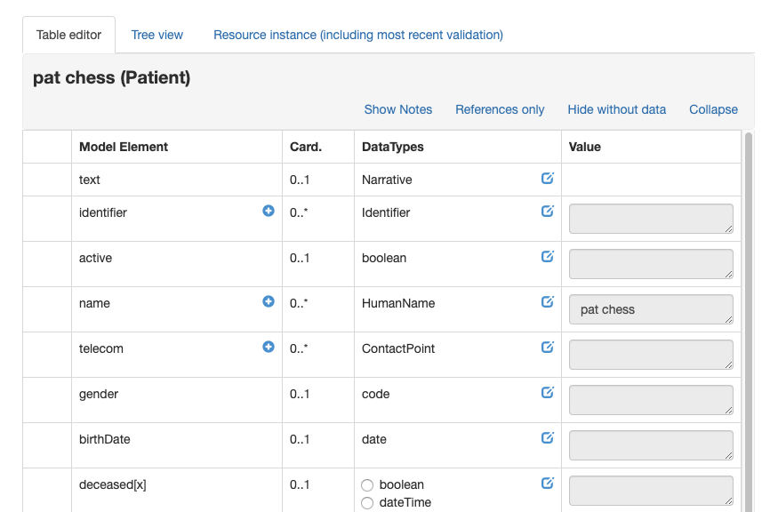

When a resource instance is selected in the left pane of the browser (whether from the list, graph or server interaction tab) it is available for editing in the right pane (except for linked resources of course).

The first tab contains the **table editor** which is the primary mechanism for adding strcutures data to the resource. Each element is a row in the tablle with the following columns:

* The first column will have a '>' icon when the element has child elements. Clicking on that icon will display the children. 
* Next is the element name. Mousing over the name will show the description of that element from the spec. The '+' symbol to the right in the column will add another copy of the element, if it is one that can repeat. Elements that have been added in this way have a '-' symbol that will remove them when clicked.
* Next is the cardinality of the element.
* Next are the possible datatypes for the element. Clicking the 'edit' icon to the right in the column displays the edit dialog for that datatype where data can be entered. New data will replace old.
    * If there is more than one allowed datatype, then there is a set of radio buttons that you use to select the type you want before clicking edit
    * If the data type is a reference, then the possible types that can be references are shown with a '-->' arrow in front of them. The result of clicking on the type name will vary according to whether there are any instances of that type already in the graph.
        * If there are no instances of that type then the app will prompt to create one
        * If there is a single instance of that type, then the app will offer to create a reference to it
        * If there is more than one instance of that type in the graph, then a dialog is shown allowing you to chose which one to reference (or create a new one)
    * The last columen shoms the current value for that element.

The **tree view** tab shows the resource as a tree, with bolded elements to show which ones have a value in the resource. Clicking the element displays the current value. The permitted datatypes are shown as links - clicking on them displays the data entry dialog.

Note that it is not possible to add another copy of an element - this must be done in the table view.

The **Resource Instance** tab shows the json view of the current resource instance. There's a link in the tab that will validate the resource using the current data server $validate operation.
     