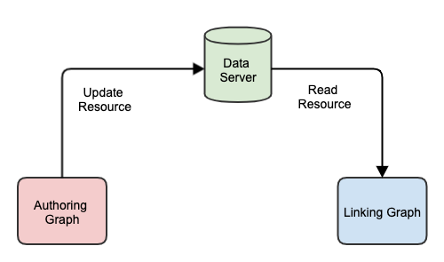

The default operation of the Graph builder is to build graphs representing scenarios which are saved in an application database on the conMan server - and can be [viewed by others](graphExisting.md). The resources in the graph can also be saved to a FHIR server, as described in the [Server interaction](graphServer.md) page. When they are saved in a FHIR server, they are just like any other resource instance there.

However there are situations where you want to 'share' resources across different graphs - and potentially different graphs from different users. To do this, you need to follow a specific process which is to 'connect' the graph with an existing patient in the server. When you do this, the other resources that reference that patient can be included (or linked to) in your graph - but they cannot be edited. It is quite possible for a single patient on the server to have resources created by different people, but only the creator can subsequently modify the resources they create.

Here's a diagram showing the relationship between the Authoring and Linking graphs - only the author can update.

There are a couple of ways that resources can be linked. In both cases the key is to 'connect' a graph with a Patient resource on the data server - after which the resources associated with that Patient (technically, in the patient [compartment](http://hl7.org/fhir/compartmentdefinition.html) can be linked to any graph.

##Existing patient
This describes the process where the patient - and other resources already exist on the server. This can be done by any number of users simultaneously (though note that the testing has not been thorough :) )

1. Create a new graph. It should be empty to start with.
2. Click the 'Select Patient' tab on the palette. There is a text box into which you can enter the patients name. Click the 'Search' link. The app will retrieve all patients with that name and display them in a list. Click the 'Select' link for the one you want. (Note that the search uses the Patient 'name' search parameter)

Once that has happened, the patient is added to the graph with a category of 'core (linked)'. Because it was not created in this graph it cannot be modified - though it can be on the server. If you select it in the graph, the editor will show only the Json contents.

However, if you select the 'Core resource types' tab in the palette, you's see a new link - 'Select from patient'. Clicking that link will display a dialog with all the existing resources for the linked patient on the data server. You can select any of them and they will be added to the graph (again, as linked resources - not editable).

You can create other resources in the graph in the usual way and create references from them to the patient (or any of the other linked resources) which can then be saved to the server and used by others. You can continue to update them - though the others will not be able to of course. 

Note that the 'master' version of the resource is held in the graph. This means that if the copy on the FHIR server is modified, those changes will be lost the next time that the graph is updated.

##New patient 
If the patient does not already exist, then it should be created by one of the users first. Make sure to enter the name using the HumanName fields (not just the text, otherwise it won't be found when other users search for it). [Save the patient](graphServer.md) to the server. After that, other graphs can be linked to that patient and add or read other resources associated with that patient.

***Note that the graph from which the patient is created won't be able link to resources that others create (at this time). If this is a potential issue, the create the Patient using a 'throw away' graph (maybe created by a dummy user), and everybody links to that Patient. This will be addressed in a future release***

