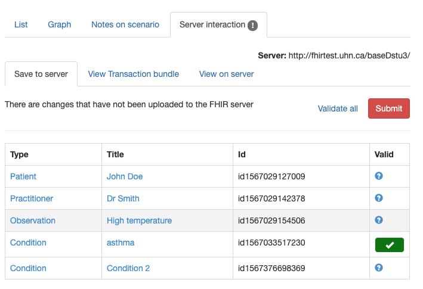

# Saving a resource to the server

When resource instances are created in the Graph Builder they are not automatically saved to the data server, which is specified as part of the Track configuration. (They are stored in an internal format on a mongoDb server on the conMan server). However, they can be saved to the Data server using options in the **Server Interaction** tab at the lower left.

This tab contains a table with all the resource instances in the graph.

Each resource instance has

* The resource type (only core types can be saved to the data server). Clicking on the type will select the resource and display the contents in the [editor pane](graphEdit.md).
* The resource title that identifies it in the graph
* The resource id that was assigned by the app. This can be used to retrieve the resource directly from the server by any other app using the syntax [host]/{type}/{id}
* Whether the resourcs instance is valid. Validation is performed by the server (using the $validate operation) and invoked by clicking the 'Validate all' link at the upper right'. There are a number of possible icons and comments than can appear in this column.
    * A green tick means that the resource instance is valid
    * A red cross indicates that it is not. Mousing over the icon will display the error message that was returned from the server (it can also be seen in the edit pane)
    * If there is no actual data in the resource, then a message is displayed

To save the resource instances in the current graph to the server, click the 'Submit' button at the top right in the tab. This will attempt to save the resources on the server. If the transaction succeeds then a message is displayed. Otherwise, an error is displayed immediately above the list of resources. A common error is not entering any data for a resource that has a reference to it. As there is no data, it will not be saved, and so the transaction will fail. Entering data in the resource and re-submitting should fix this problem (and clicking the type in the first column will select the resource ready for editing.

Technically, what happens is that a transaction containing the resources is created and sent to the server. Resources are saved using the PUT operation (as the app assigns the ids). 

# Validating a resource
It is also possible to validate a resource without saving it to the server. This can be done by clicking the *Validate all* link. There is also a validate option in the [editor](graphEdit.md).

